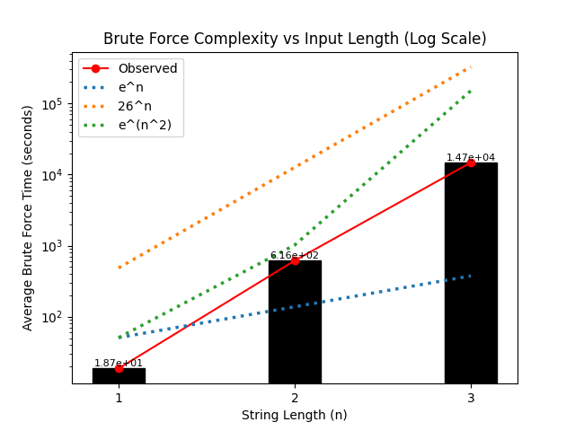

# `hash-tag-me-too` 💀

## Overview

Please check out my <a href="https://github.com/AngadBasandrai/hash-tag-me-too">repo</a> on this.


This project implements a simple custom hashing algorithm designed for experimentation and understanding how hash functions behave.

It takes a string as input and produces a deterministic 128-bit integer output. The design focuses on mixing operations and state transformations rather than cryptographic security.

## Characteristics

Deterministic: same input → same output
Fixed-size output (128-bit)
Uses bitwise operations and rotations
Includes data-dependent memory access for increased computational cost

## Algorithm Structure

The algorithm maintains four 32-bit state variables:

a, b, c, d

These values are continuously updated to produce the final hash.

### Initialization
The state is initialized with fixed constants:

a = 0x12345678
b = 0xabcdef12
c = 0x89abcdef
d = 0x11111111

### Character Processing
Each input character is converted to its ASCII value and processed through 4 rounds of mixing.

Each round applies:

XOR operations
Left rotations
32-bit modular addition

Input is injected into multiple state variables using rotated variants of the character value, improving diffusion across the state.

Operator grouping is explicitly controlled to avoid unintended precedence effects and ensure consistent mixing behavior.

Bitwise AND and OR operations have been reduced in favor of XOR and addition to improve entropy propagation.

All state variables are updated in each round, ensuring that changes propagate across the entire state.

### Data-Dependent Memory Mixing
During each round, the algorithm performs memory accesses based on the current internal state.

A large memory buffer is initialized and accessed using indices derived from a, b, c, d. The retrieved values are mixed back into the state and may also update the memory itself.

This introduces additional computational cost and reduces predictability during execution.

### Final Mixing
After processing all characters, 12 additional rounds are applied to further diffuse the internal state.

These rounds also incorporate memory-dependent values to increase mixing complexity.

### Output
The final 128-bit hash is formed by concatenating:

a (highest 32 bits)
b
c
d (lowest 32 bits)

### Summary
The function repeatedly mixes a small internal state using bitwise and arithmetic operations, along with data-dependent memory access, producing a fixed-size 128-bit output.

# Previous Versions

## Version 0.1: 32-bit

Before the current design, a simpler version of this algorithm was used.

It followed the same overall structure (same state variables and initialization), but with a few key differences:

* Each character was processed with **a single mixing step**
* There was **no final mixing phase**
* The output was reduced to a **single 32-bit value**

In practice, this made the hash much weaker:

* Collisions were noticeably more common
* Similar inputs (e.g. `"hello"` and `"hellc"`) often produced the same hash
* Output patterns were easier to spot

## Version 1.0: 128-bit

This version was introduced to fix the issues in v0.1 by:
* Increasing mixing per character
* Adding a final diffusion phase
* Expanding the output size

These changes make brute forcing slightly slower and reduce obvious patterns in the output.
While a significant improvement on v0.1, this version was still quite easy and quick to brute force for smaller lengths.
Also it relied on `&` and `|` operations which result in worse mixing than `^`

# Current Version

## Version 1.1: 128-bit

This version combats the problems in v1.0 by:
* Adding an ~8MB data lookup table and memory dependent mixing (this increases brute force time significantly without increasing time complexity)
* Reduced reliance on `&` and `|` in favor of `^`.
* Input is injected into multiple state variables using rotated variants of the character value, improving diffusion across the state.

## Usage

```python
from funcs import hasher

print(hasher("hello"))
```


## Notes

This algorithm is:
* Not suitable for cryptographic use
* No formal security analysis
* Performance not optimized for large-scale use

<br/>

A brute-force solver exists in this project for testing and benchmarking purposes. It can recover inputs for small string lengths by exhaustively searching the input space.

## Complexity Plot



The plot shows clear exponential growth in brute-force time. Some comparison curves appear misleading due to scaling and the small range of input sizes.

*Note: Each data point is averaged over 25 samples, so results are indicative rather than strictly statistically robust.*

The times for this newer algorithm are much higher and for the next update I will be porting my code to C/C++.

To compare, previous algorithm's brute-force time:

