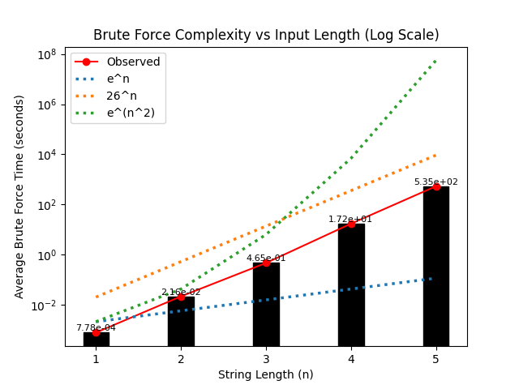

# `hash-tag-me-too` 💀

## Overview

Please check out my <a href="https://github.com/AngadBasandrai/hash-tag-me-too">repo</a> on this.

This project implements a simple custom hashing algorithm designed for experimentation and understanding how hash functions behave.

It takes a string as input and produces a deterministic 128-bit integer output. The design focuses on mixing operations and state transformations rather than cryptographic security.

## Characteristics

* Deterministic: same input → same output
* Fixed-size output (128-bit)
* Uses bitwise operations and rotations

## Algorithm Structure

The algorithm maintains four 32-bit state variables:

* `a`, `b`, `c`, `d`

These values are continuously updated to produce the final hash.

---

### Initialization

The state is initialized with fixed constants:

* `a = 0x12345678`
* `b = 0xabcdef12`
* `c = 0x89abcdef`
* `d = 0x11111111`

---

### Character Processing

Each input character is converted to its ASCII value and processed through **4 rounds of mixing**.

Each round applies:

* XOR operations
* Bitwise AND / OR
* Left rotations
* 32-bit modular addition

All state variables are updated in each round, ensuring that changes propagate across the entire state.

---

### Final Mixing

After processing all characters, **12 additional rounds** are applied to further diffuse the internal state.

---

### Output

The final 128-bit hash is formed by concatenating:

* `a` (highest 32 bits)
* `b`
* `c`
* `d` (lowest 32 bits)

---

### Summary

The function repeatedly mixes a small internal state using bitwise and arithmetic operations, producing a fixed-size 128-bit output.

## Previous Version (32-bit)

Before the current design, a simpler version of this algorithm was used.

It followed the same overall structure (same state variables and initialization), but with a few key differences:

* Each character was processed with **a single mixing step** (no 4-round loop)
* There was **no final mixing phase**
* The output was reduced to a **single 32-bit value** instead of 128-bit

In practice, this made the hash much weaker:

* Collisions were noticeably more common
* Similar inputs (e.g. `"hello"` and `"hellc"`) often produced the same hash
* Output patterns were easier to spot

The current version was introduced to address these issues by:

* Increasing mixing per character
* Adding a final diffusion phase
* Expanding the output size

These changes make brute forcing slightly slower and reduce obvious patterns in the output.


## Usage

```python
from funcs import hasher

print(hasher("hello"))
```


## Notes

This algorithm is:
* Not suitable for cryptographic use
* No formal security analysis
* Performance not optimized for large-scale use

<br/>

A brute-force solver exists in this project for testing and benchmarking purposes. It can recover inputs for small string lengths by exhaustively searching the input space.

## Complexity Plot



The plot shows clear exponential growth in brute-force time. Some comparison curves appear misleading due to scaling and the small range of input sizes.

*Note: Each data point is averaged over 25 samples, so results are indicative rather than strictly statistically robust.*

---

<p align="center">
  Made with ❤️ by <b><a href="https://github.com/AngadBasandrai/">Angad Basandrai</a></b>
</p>